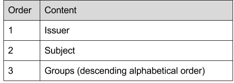
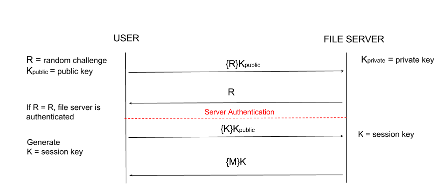
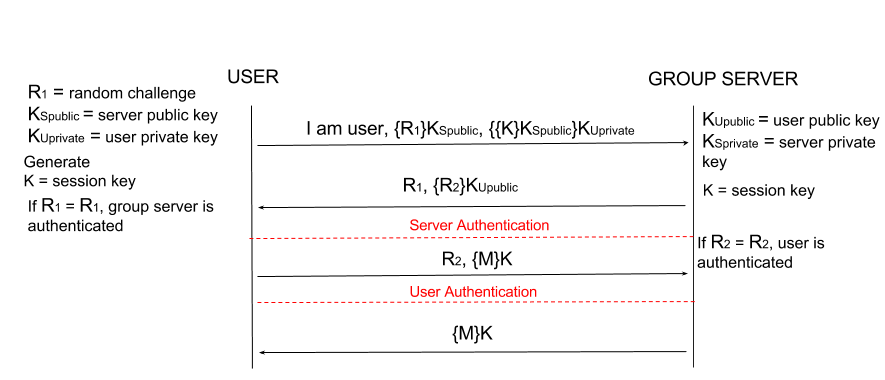

# Cryptographic Mechanisms
After considering the types of threat models our file-sharing program will be faced with, we've decided to implement new security enhancements which are primarily based on two concepts: ease of use and coverage. Our mechanisms are designed to ensure that legitimate users may interact with the servers without any additional frustration due to increased security. Our user-facing public key system will be simple and easily-accessible for a user while still being robust enough to protect against unauthorized token issuance. We decided to utilize RSA encryption for many of our protection mechanisms. This is both to provide economy of mechanism for the codebase and also because RSA provides coverage for three of our four threat models. 

Our implementation utilizes the following mechanisms:
* SHA256: We utilize SHA256 for hashing within our system. We chose to use SHA256 instead of SHA1 due to SHA1 being considered broken. Since this is just a file sharing service, SHA256 seems more than adequate rather than going with a more heavy-handed SHA512.
* RSA: Our implementation uses 2048 bit RSA keys for public key encryption. 1024 RSA keys are considered dead. 2048 bit keys are still considered secure and provide us with performance and storage benefits over 4096 bit keys, while still supplying us with sufficient security. In addition, 4096 bit RSA keys has potential compatibility concerns with older hardware, we would like to reach the widest audience possible while still providing adequate security.
* Random Number Challenge: The size of all random challenges utilized are 256 bits. This size is sufficently large to protect against brute force random guessing of the challenge by an adversary. Random challenges will not be reused.
* AES: For symmetric key encryption within our system (for session keys), we will utilize AES with a 128 bit key size. We chose 128 bit keys over 256 keys as 128 bit keys are significantly faster but still sufficent security-wise.  

## T1: Unauthorized Token Issuance
NOTE: **T1** and **T4** are heavily intertwined. If something may be unclear here it is may be expound upon in **T4**.

The token stores all of a user's data and since clients are assumed to be untrusted, our system must need to protect against illegitimate clients requesting tokens. We do not want anyone that is not the owner of the token to be able to request the token since it could possibly reveal private or sensitive information about said user. On top of that, if somebody obtains a user's token they would be able to impersonate that user which would compromise groups, or even the server if it is an admin token.  

Example: Bob is an administrator on our file sharing service. Mallory requests Bob's token and subsequently wipes the service of users, groups, and files.  

### Mechanism
NOTE: Then token itself is not sent, but the contents. This is expound upon in **T2**.

ASSUMPTION: **T3** is properly implemented and public keys are exchanged prior to the start of this exchange.

We will utilize public key cryptography, RSA in particular, to establish and exchange a session key. The client will initiate the connection to the group server by sending a message indicating who they are, as well as a nonce encrypted with the server's public key. The server decrypts the message and sends the first nonce along with a second nonce encrypted with the user's public key. The user then responds with the second nonce as well as a session key that is signed by the user. Both the server and the user are now mutually authenticated and can communicate over a shared session key. The token may now be encrypted using the shared session key and sent to the user.

### Justification
NOTE: Justification for the session key and using RSA over diffie hellman are expound upon in **T4.** A second simple application is built just to generate key pairs. User can generate the key pair then give the public key to the administrator to create the account outside the system.

Using RSA to authenticate provides us better, more robust security over using a standard password based system. In addition, this system was already being implemented for T4 to establish and exchange a session key. Since this system provides mutual authentication it makes sense to simplify things and not use a redundant system like passwords.

## T2: Token Modification/Forgery
Assumption: **T4** is correctly implemented, this message will be encrypted.

If users can increase their own access rights at will, they can tamper with any file they wish. They could delete all the files on the server, or download files that aren't meant for them. Additionally, users who can counterfeit tokens could distribute them to whomever they wish, which takes away rights from the administrator. 

Once forged tokens come into existence, stopping distribution and use becomes more difficult. If there is no way to dinstiguish between a legitimate token and a forged one, innocent users may end up getting targeted as well.

### Mechanism
We will utilize RSA to both authenticate and exchange keys. The group server will generate a key pair, consisting of a public key and a private key for the itself. Key generation for user accounts will occur at the time of account creation by use of a seperate KeyGeneration program. This Keypair generation occurs prior to the Admin creating an account. The user "hands" the admin the public key to create the account, again outside the system.

When the server creates a token, it will first stream the individual (delimited) issuer, subject, and group information into a byte array. The standard order is illustrated in the diagram below. We will then utilize SHA256 to make a hash of the byte array. The result of that hash will be signed by the server. The server will then send the signed hash of token information to the user, along with a challenge which is encrypted with the user's public key. We can then verify that signature of the hash of the token data to validate the user's token.  

### Justification
With public-key authentication, signatures created by the user's private key cannot be forged by anybody who does not have the key. However, a third party who has the public key would be able to verify that a signature is valid. This ensures that forged tokens will not be accepted, as a third party would be able to verify if the signature is valid or not. RSA in particular was chosen because it can be also be utilized for multiple other mechanisms, providing coverage and economy of mechanism. 

Rather than sign and transfer the token as it is, we've decided to instead send a signed hash of the token's data. This is due to both the size of the token and also the fact that it's the token's relevant data, and not the Java object itself, that we want to transfer. We picked SHA256 for our hash algorithm for further economy of mechanism, as we also use it to hash our passwords in T1.

The token's issuer, subject, and group information will be delimited prior to hashing to provide collision resistance.

## T3: Unauthorized File Servers
Since we may only assume that file servers are entirely trustworthy after they have been properly authenticated, we must ensure that if a user wishes to contact a server, that they actually connect to that server and not some other server that is potentially malicious. Since any user may run a file server, the group server may not be required to know about all file servers and thus may not be used in user authentification of a file server. 

Connecting to a malicious server while the user is under the impression that they are connected to the intended server brings about a number of problematic situations. For example, if Bob connects to a malicious server posing as the server Bob intended to access, the malicious server now has direct access to any file that Bob uploads which is a breach of data confidentiality. The malicious server can also breach data integrity, if Bob requests a file the server can return any information that it so chooses to pose as that file. Finally, this situation threatens data avaliablitity if Bob requests an avaliable file and the malicious server doesn't return the file.

### Mechanism
When a file server is created, the server will generate a public and private RSA key pair. When a user attempts to connect to a server,  the server will send the user it's public key fingerprint. The fingerprint and IP will be checked against stored information on the client, and if there is a mismatch or the server's information does not yet exist on the client (first connection), the user will be prompted with the server's name, fingerprint, and IP, and asked if they would like to connect to this server at their own risk. If the user accepts, the server's information is stored (name, IP, public key) on the client. When a user attempts to authenticate a file server, the user will generate and encrypt a random challenge with the server's public key. The file server will be able to decrypt the challenge with its private key. The server then sends back that random challenge to the user.

### Justification
By encrypting a random challenge with a server's public key, only the owner of that private key will be able to decrypt. Since we are assuming the storage of server public keys is trustworthy due to the assumption that adversaries are only passive, only the intended server will have the matching private key. This authenticates that file server the user interacts with is the intended file server. This uses less client CPU time than the Diffie-Hellman algorithm specified as part of the core SSH protocol (RFC 4432). Since one of the core concepts of our system is ease of use, we allow the user to authenticate servers quickly. RSA is also convenient as it is utilized in other ways by the system. Past random challenges will be recorded in a bin file to prevent against replay attacks to ensure that old challenges are not accepted or used. Our mechanism was inspired by the SSH host verification scheme. 

RFC 4432 - http://www.ietf.org/rfc/rfc4432.txt
SSH Host Key Checking - https://www.ibm.com/support/knowledgecenter/SSLTBW_2.3.0/com.ibm.zos.v2r3.foto100/hostch.htm

## T4: Information Leakage via Passive Monitoring
Since we must assume that all activity on the servers is being monitored by a passive observer, it is imperative to ensure that the observer cannot glean any useful information from any communication. Although the observer himself cannot act on the knowledge, there is nothing stopping him from brokering it. The act of snooping in and of itself is also a threat of disclosure which violates any users' confidentiality. It is additionally important that this threat model is properly dealt with, as other mechanisms will rely on this threat being neutralized to be effective.

### Mechanism
Mutual authentication and setup is identical to that in **T1**. All communication after the setup described in **T1** will take place utilizing an AES session key.

The client will initiate the connection to the file server. After authentication of the file server as described in T3, the user will send a shared session key, K, encrypted with the file server's public key. The file server will decrypt K using the server's private key. The user and server now share a secret session key. All further messages will be encrypted with the session key before being exhanged.

### Justification
Using RSA to authenticate and exchange the symmetric session key allows us better performance than using just RSA. The session key will be a 128bit AES key since that is the biggest allowed by JavaCrypto, and AES is essentially the de facto standard for symmetric key cryptography and provides us with sufficient security. So long as we generate a sufficiently large "probably" prime number, our key exchange will be secure. A diffie-hellman exchange would also allow us to exchange a session key, but RSA seems easier to implement overall since it can be used in a variety of use cases in our system. 

## Final Thoughts
To account for ease of use and coverage, our security enhancements rely mainly on a user-facing password system and RSA encryption. The interplay of our mechanisms in response to the specific threats work well together, as they all have an underlying dependence on RSA public key encryption. The security mechanisms specifically address user legitimacy for interaction with servers without an excess of user burder for system interactions. Our mechanisms also ensure that untrusted users may not elevate access rights or attempt to create false tokens. File servers are authenticated by the user before interaction and communications between client and server are protected from passive adversaries.
