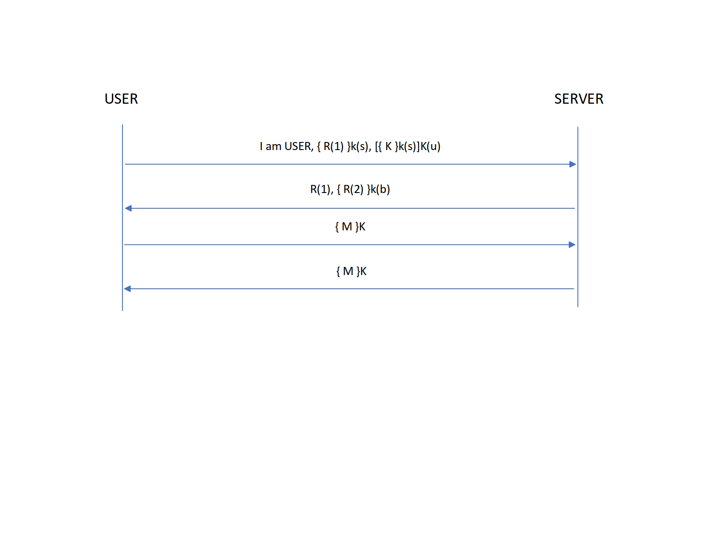
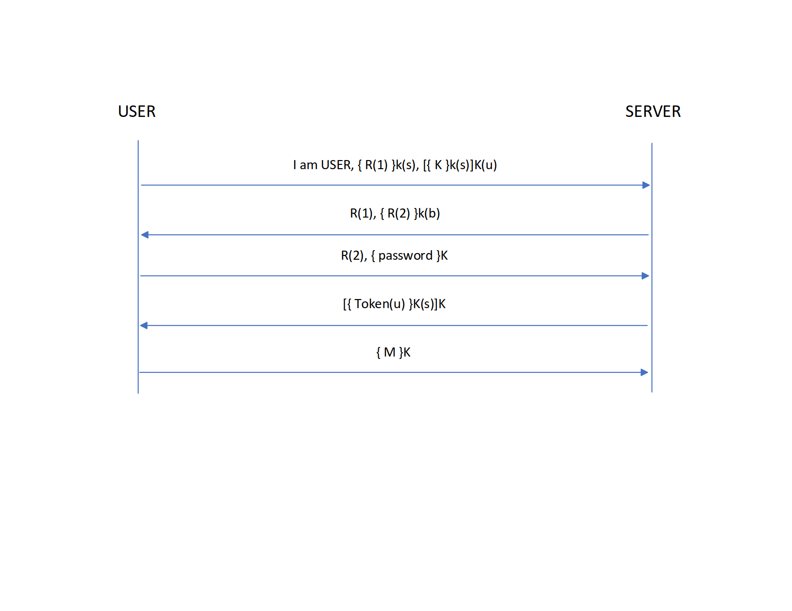

# Cryptographic Mechanisms
After considering the types of threat models our file-sharing program will be faced with, we've decided to implement new security enhancements which are primarily based on two concepts: ease of use and coverage. Our mechanisms are designed to ensure that legitimate users may interact with the servers without any additional frustration due to increased security. Our user-facing password system will be simple and easily-accessible for a user while still being robust enough to protect against unauthorized token issuance, due to salting and hashing. We decided to utilize RSA encryption for many of our protection mechanisms. This is both to provide economy of mechanism for the codebase and also because RSA provides coverage for three of our four threat models. 

## T1: Unauthorized Token Issuance
The token stores all of a user's data and since clients are assumed to be untrusted, our system must need to protect against illegitaimate clients requesting tokens. We do not want anyone that is not the owner of the token to be able to request the token since it could possibly reveal private or sensitive information about said user. On top of that, if somebody obtains a user's token they would be able to impersonate that user which would compromise groups, or even the server if it is an admin token.  

Example: Bob is an administrator on our file sharing service. Mallory requests Bob's token and subsequently wipes the service of users, groups, and files.  

### Mechanism
We will implement a password authentication protocol to authenticate users when requesting a token. The password will be a secret that only the user knows. To aid in the protection of brute-force password attacks, passwords will be subject to a length constraint of 12 characters or greater. Upon user creation, a user will be asked to create a password satisfying the length constraint. Then the password will have a salt that is generated using java.security.SecureRandom appended to it. The password will then be hashed using sha256. The hash as well as the salt will be stored along with the user in UserList.bin. When a user requests a token they be prompted to enter a password. The password will be sent to the server and have the salt appended to it, then hashed, then checked against the stored hash. If the hashes match the token will be issued.   

### Justification  
We chose to use SHA256 instead of SHA1 due to SHA1 being considered broken. Since this is just a file sharing service, SHA256 seems more than adequate rather than going with a more heavy-handed SHA512. 

Using passwords gives the user a secret that only he knows to log in. Since only the hash and salt are stored on the server, thanks to pre-image resistance even if the database (UserList.bin in this case) compromised the password will still be sufficiently secure. To avoid monitoring of communcations channel compromising passwords since they are passed in plaintext, the security of this implementation relies on the assumption that **T4** is properly addressed, since that threat is out of scope. 

## T2: Token Modification/Forgery
If users can increase their own access rights at will, they can tamper with any file they wish. They could delete all the files on the server, or download files that aren't mean for them. Additionally, users who can counterfeit tokens could distribute them to whomever they wish, which takes away rights from the administrator. 

Once forged tokens come into existence, stopping distribution and use becomes more difficult. If there is no way to dinstiguish between a legitimate token and a forged one, innocent users may end up getting targeted as well.

### Mechanism
We will extend the UserToken interface to utilize RSA to both authenticate and exchange keys. The server will generate a key pair, consisting of a public key and a private key, and will generate a signature using the private key. We can then verify that signature to validate the token. 

### Justification
With public-key authentication, signatures created by the user's private key cannot be forged by anybody who does not have the key. However, a third party who has the public key would be able to verify that a signature is valid. 

RSA in particular was chosen because it can be also be utilized for Threat Models 3 and 4 as well. 

## T3: Unauthorized File Servers
Since we may only assume that file servers are entirely trustworthy after they have been properly authenticated, we must ensure that if a user wishes to contact a server, that they actually connect to that server and not some other server that is potentially malicious. Since any user may run a file server, the group server may not be required to know about all file servers and thus may not be used in user authentification of a file server. 

Connecting to a malicious server while the user is under the impression that they are connected to the intended server brings about a number of problematic situations. For example, if Bob connects to a malicious server posing as the server Bob intended to access, the malicious server now has direct access to any file that Bob uploads which is a breach of data confidentiality. The malicious server can also breach data integrity, if Bob requests a file the server can return any information that it so chooses to pose as that file. Finally, this situation threatens data avaliablitity if Bob requests an avaliable file and the malicious server doesn't return the file.

### Mechanism
When a file server is created, the server will generate a public and private RSA key pair. The public key will be added to a list of file server public keys kept in a bin file. Since it is assumed that the system is monitored by a only passive adversary, we assume that the list of public keys can be seen as plain text but not modified. When a user attempts to authenticate a file server, the user will generate and encrypt a random challenge with the server's public key. The file server will be able to decrypt the challenge with its private key. The server then sends back that random challenge to the user.

### Justification
By encrypting a random challenge with a server's public key, only the owner of that private key will be able to decrypt. Since we are assuming the list of file server public keys is trustworthy due to the assumption that adversaries are only passive, only the intended server will have the matching private key. This authenticates that file server the user interacts with is the intended file server. This uses less client CPU time than the Diffie-Hellman algorithm specified as part of the core SSH protocol (RFC 4432). Since one of the core concepts of our system is ease of use, we allow the user to authenticate servers quickly. RSA is also convenient as it is utilized in other ways by the system.

## T4: Information Leakage via Passive Monitoring
Since we must assume that all activity on the servers is being monitored by a passive observer, it is imperative to ensure that the observer cannot glean any useful information from any communication. Although the observer himself cannot act on the knowledge, there is nothing stopping him from brokering it. The act of snooping in and of itself is also a threat of disclosure which violates any users' confidentiality. It is additionally important that this threat model is properly dealt with, as other mechanisms will rely on this threat being neutralized to be effective.

### Mechanism
We will utilize public key cryptography, RSA in particular, to establish and exchange a session key. The client will initiate the connection to the server by sending a message indicating who they are, as well as a random number encrypted with the server's public key and the session key encrypted with the server's public key which is then signed by the user. The server decrypts the messages, and sends the first random number along with a second random number encrypted with the user's public key. The user then responds with the second random number. Now all messages can be exchanged using the secret session key. 

### Justification
Using RSA to authenticate and exchange the symmetric session key allows us better performance than using just RSA. The session key will be a 128bit AES key since that is the biggest allowed by JavaCrypto, and AES is essentially the de facto standard for symmetric key cryptography. So long as we generate a sufficiently large "probably" number, our key exchange will be secure. A diffie-hellman exchange would also allow us to exchange a session key, but RSA seems easier to implement overall since it can be used in a variety of use cases in our system. 

## Final Thoughts
To account for ease of use and coverage, our security enhancements rely mainly on a user-facing password system and RSA encryption. The interplay of our mechanisms in response to the specific threats work well together, as they all have an underlying dependence on RSA public key encryption. The security mechanisms specifically address user legitimacy for interaction with servers without an excess of user burder for system interactions. Our mechanisms also ensure that untrusted users may not elevate access rights or attempt to create false tokens. File servers are authenticated by the user before interaction and communications between client and server are protected from passive adversaries.

RFC 4432 - http://www.ietf.org/rfc/rfc4432.txt
