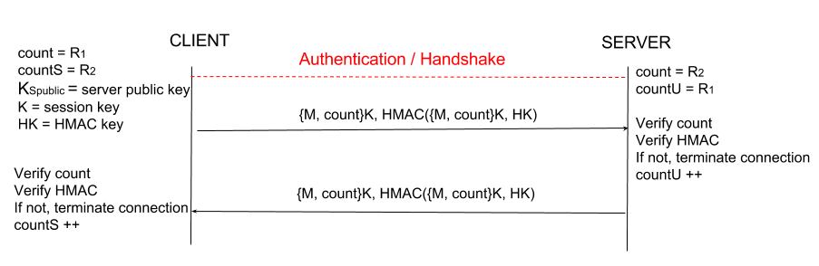
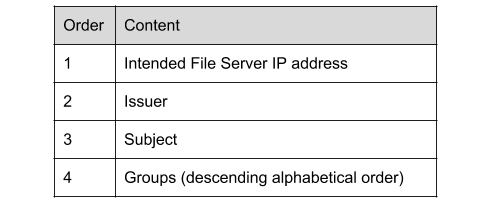

# Cryptographic Mechanisms
We have added new mechanisms in order to deal with three additional threat models while keeping our main ideas of ease of use and coverage at the forefront. As economy of mechanism is an integral aspect of our design philosophy, many of our previous mechanisms could be modified to provide more protection where otherwise it might have been necessary to design or integrate entirely new mechanisms. 

Our implementation utilizes the following mechanisms:

* **SHA256:** We utilize SHA256 for hashing within our system. We chose to use SHA256 instead of SHA1 due to SHA1 being considered broken. Since this is just a file sharing service, SHA256 seems more than adequate rather than going with the more heavy-handed SHA512.
* **RSA:** Our implementation uses 2048 bit RSA keys for public key encryption. 1024 bit RSA keys are considered dead. 2048 bit keys are still considered secure and provide us with performance and storage benefits over 4096 bit keys, while still supplying us with sufficient security. In addition, 4096 bit RSA keys have potential compatibility concerns with older hardware and we would like to reach the widest audience possible while still providing adequate security.
* **Random Number Challenge (Nonce):** The size of all random challenges utilized are 256 bits. This size is sufficiently large to protect against brute force random guessing of the challenge by an adversary. Random challenges will not be reused.
* **AES:** For symmetric key encryption within our system (for session keys), we will utilize AES with a 128 bit key size. We chose 128 bit keys over 256 bit keys as 128 bit keys are significantly faster but still sufficient security-wise, and 128-bit is the largest allowed by JavaCrypto. We utilize CBC as the mode of operation as CBC provides message dependence for generating cipher text unlike ECB mode, which is subject to code book attacks. This is particularly relevant to **T5** below.
* **MD5:** We utilize MD5 within our system for generating public key fingerprints. MD5 produces human readible fingerprints, which is necessary for our purposes. MD5 is also used for SSH host verification, which is why we chose it compared to SHA1. Further, we use MD5 to implement HMAC to ensure data integrity.
* **Counter:** Counters will be an integer count of the next expected message number. This number will be incremented each time a message is received. Initial number count for each party is elaborated upon in **T5**

Mechanisms T1-T4 can be found here: https://github.com/NohrianScum/cs1635-2017fa-kdc42-ruz24-sjd69/blob/master/phase3-init/reports/phase3-writeup.md

# T5: Message Reorder, Replay or Modification
**Assumption 1:** The initial handshake and authentication between either the group or file server and the client is as specified in the diagrams below.

After connecting to and properly authenticating a group or file server, the messages passed between the client and server are subject to being reordered, saved for a replay attack, or modified by an active adversary. Modifying messages can affect the integrity and avaliability of data stored on the server or received by the user. An adversary that may insert communications, such as deleting a file from a server, can disrupt data availablility. Inserting fake communications can also compromise data integrity as malicious files may be placed onto the server or sent to the user. Reordering communications can also compromise data avaliablility and integrity. For example, a user wishes to download a file and then delete the file from a server. Reordering these messages deletes the file before the user can access it. 

To protect against **T4** in the previous phase of this project, our file sharing system uses a unique secret session key to encrypt communications between a server and a client. This mechanism offers protection against passive adversaries, and protection from replay attacks between sessions. Our current implementation does not protect against an active attacker that can insert, reorder, replay or modify messages within a session. To offer protection against this stronger attack, we utilize message counters and HMACs in addition to the previously implemented session key.

### Mechanism
Our file sharing system utilizes a 128 bit AES (CBC mode) session key from the previous phase. The use of CBC mode, as opposed to ECB mode, prevents an adversary from generating a code book to use for a replay attack within a session, as CBC mode creates message dependence of cipher text.

##### Replay and Reordering
The addition of a message counter will protect against replay and reordering attacks. Each communication will include a message number before encryption with the session key. At the time of connection, both the server and client will begin keeping track of the count of messages recieved from the other party. Each message will be sent with the count number of the message. The party receiving the message will verify that the message number received is the next message expected based on the count. If the message number is not as expected, we assume a reordering attack and terminate the connection. The random number used for authentication will be the initial message count for both the user and group server. The file server will default to begin the message count at 0. This way, the opposite party will now be able to verify the message count number without the exchange of further messages. Servers will store a bin file of random numbers that have previously been used as initial counters, and will not accept random numbers that have previously been used. If the server receives a random challenge that has been previously used, we assume a replay attack and terminate the connection.

##### Modification
The addition of the HMAC-MD5 will protect against message modification. A second session integrity key will be generated client-side and transmitted along with the previously implemented session key. During communication, the HMAC will be saved and transmitted to the recipient. The receiving party can then recompute and verify the HMAC of the message using the session integrity key. However, any attacker who would attempt to intercept and modify the message would be unable to recompute the HMAC to correctly match the modification, since the adversary does not have access to the symmetric key. If the HMAC sent does not match the HMAC computed, we assume a reordering attack and terminate the connection. 

### Justification
We utilize a HMAC over a public key signature to protect message integrity for speed. The HMAC will allow a receiving party to verify that the message has not been modified, since an adversary will not be able recompute the HMAC after modification since they do not have access to the session key. Keeping a message count and numbering messages ensures that messages are being received in the correct order, preventing replay of individual messages by an adversary. Receiving a message out of correct and expected order will be immediately detectable. Further, the usage and storage of unqiue initial counter numbers for each party (based on the random numbers for authentication) prevents an entire session from being replayed. Since old random numbers will not be accepted, an attempt to replay an entire connection will be detected. 

### Diagram

# T6: File Leakage
Although we authenticate file servers in the previous phase of the project, we still assume that properly authenticated servers may be malicious. Since we assume file servers to be untrusted, we assume that they may leak files stored on the server to unauthorized individuals at will. This disrupts data confidentiality of group files since users are under the assumption that only valid group members may have access to those files. We also need a way to adapt the secure storage of files with dynamic group membership. When a user is removed from a group, he or she should not have a mechanism to uncover leaked files created since he or she was removed from that group. When a new user is added to a group, he or she should be able to uncover all files within that group even those created prior to the time that user was added to the group.

### Mechanism
**Policy:** A user who is deleted from a group is not able to directly access a file through our system. However, at the time a user was a member of a group, he or she had full access to these files and we assume that all files were downloaded. We assume that a removed group member keeps old group keys so that he or she will be able to decrypt a leaked file from that group if it was avaliable. An old group member will not be able to decrypt any leaked file created or modified since that user was removed from the group. A member added to the group at a later time is able to access all files from the inception of that group.

**Assumption 1:** There exists a client-side file crypto application that encrypts and decrypts files using the group keys. 
**Assumption 2:** This exchange is happening after authentication and the establishment of an encrypted session between a client and a server.

Upon group creation, a group key will be generated. As with the session key already utilized within our file system, the group key will be a 128-bit AES key using CBC mode. For each group, the Group Server will store this key. When a member is deleted from a group, a new key will be generated and stored. The keys will be stored in a list that is part of a Hashtable. Specifically, a Hashtable<groupName, ArrayList<KeySet> keyList>. The index of the key corresponds to its freshness (i.e. it is monotonically increasing).

When a user logs in to the system, the current and past keys for each group that user is a member of (designated by the group keychains) will be avaliable. Before uploading a file to a file server, the user must encrypt the file using the freshest group key via the file encyrption application and send the encrypted file along with the version number of that key to the file server. Encrypted files will be wrapped in an object consisting of the index number of the key used (its version number), and the encrypted file.  When a user downloads a file from a file server, the client will decrypt the file (via the client-side crypto application) using the specified version of the group key that will be found in the group keychain. 

### Justification
Files stored on file servers will now be encrypted with unique group keys. This way, if a file server leaks a file, only members of the group will be able to decrypt it as users only have access to the keychain for groups that they are currently members of. Unauthorized parties will not be able to glean any information from the file without the key, since files are encrypted with a secret key. Each time a user leaves a group, a fresh key is generated and subsequently used for file encryption. The past group member will no longer have access to the group keychain and will therefore not have access to the new secret group key. Assuming that users save keychains, previous members of the group will be able to decrypt leaked files that were created at the time that user was a member, but will not be able to decrypt any files created or modified after removal, since these files will be encrypted with keys generated after that user's removal from the group. This security will not prevent new users joining the group from accessing old files as they have access to all versions of keys in their keychain. The Group Server will manage the group keys and grant users access to group keychains, but encryption and decryption will take place on the client side to maintain the separation of the group and file servers.

### Diagram

# T7: Token Theft
In **T2** we dealt with the possible counterfeit of tokens. However, there is still an issue of tokens being stolen by the assumed untrusted file server and subsequently passed to other invalid users to be used in other servers. A single token should *only* belong to a single user. However, since we must accept that stolen tokens may be a possibility, these stolen tokens should *only* be operable within the server it was stolen by. If this is not the case, a single token can be stolen and subsequently used across servers to bypass other security mechanisms and allow users permissions that they are not supposed to have by posing as the owner of that token. 

### Mechanism
**Assumption:** Token objects will now accept a new parameter: intended file server IP address.

When a user requests a token from the group server, they will also be prompted to tell the group server which file server they intend to use that token on. We will include an extra String field in the token object for the file server's IP address. When a token's data is hashed and signed by the group server (as in the mechanisms for **T2**), that will include the file server's name. Note that the consequence of this security mechanism necessitates a user both connects to the group server and requests a new token each time that he or she wishes to connect to a different file server. When the user communicates with the file server, the server will verify both the correctness of the file server name and the signature from the appropriate group server before accepting the token as valid. If the file server sees a different IP address, we will terminate the connection because we know this token was not intended to be used on this server by the user and we can assume that the token has been stolen. This way, stolen tokens may only be used on the server where the theft took place.

### Justification
Requiring the file server to validate token usage intention information prevents inter-server use of a single token, as each token will be generated for one and only one specific file server. This file server IP address information can be easily added to the token data that is to be streamed into a byte array and hashed as part of our **T2** mechanism, requiring minimal additions to the codebase. The process of **T2** ensures that the token has not been tampered with since it was issued originally by the group server. 

### Diagrams

# Final Thoughts
We were able to make use of our previous protocols and extend then by adding extra information such as counters, HMACS, and extended intended server information to protect against the new threats mentioned above. The combination of counters and HMACs provides protection against replay attacks, reordering attacks, and modification attacks, furthering the protection of a session key for each connection between a server a client. Specifying a file name where the token will be used prevents stolen tokens from being used at any server other than where the threat occured. Finally, files stored on file servers will now be encrypted with unique group keys to prevent unauthorized file leakage.
