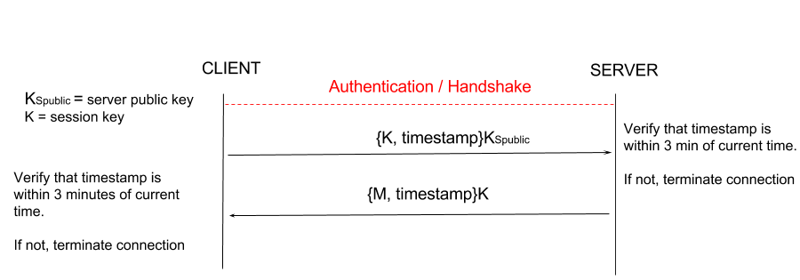
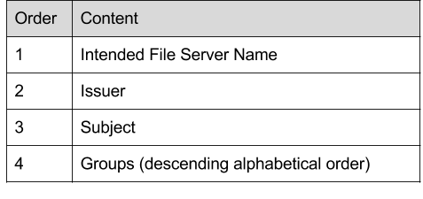

# Cryptographic Mechanisms
We have added new mechanisms in order to deal with three additional threat models while keeping our main ideas of ease of use and coverage at the forefront. As economy of mechanism is an integral aspect of our design philosophy, many of our previous mechanisms could be modified to provide more protection where otherwise it might have been necessary to design or integrate entirely new mechanisms. 

Our implementation utilizes the following mechanisms:

* SHA256: We utilize SHA256 for hashing within our system. We chose to use SHA256 instead of SHA1 due to SHA1 being considered broken. Since this is just a file sharing service, SHA256 seems more than adequate rather than going with a more heavy-handed SHA512.
* RSA: Our implementation uses 2048 bit RSA keys for public key encryption. 1024 RSA keys are considered dead. 2048 bit keys are still considered secure and provide us with performance and storage benefits over 4096 bit keys, while still supplying us with sufficient security. In addition, 4096 bit RSA keys have potential compatibility concerns with older hardware, we would like to reach the widest audience possible while still providing adequate security.
* Random Number Challenge (Nonce): The size of all random challenges utilized are 256 bits. This size is sufficently large to protect against brute force random guessing of the challenge by an adversary. Random challenges will not be reused.
* AES: For symmetric key encryption within our system (for session keys), we will utilize AES with a 128 bit key size. We chose 128 bit keys over 256 keys as 128 bit keys are significantly faster but still sufficent security-wise and 128-bit is the largest allowed by JavaCrypto. We utilize CBC as the mode of operation as CBC provides message dependence for generating cipher text unlike ECB mode, which is subject to code book attacks. This is particularly relevant to **T5** below.
* MD5: We utilize MD5 within our system for generating public key fingerprints. MD5 produces human readible fingerprints, which is necessary for our purposes. MD5 is also used for SSH host verification, which is why we chose it compared to SHA1.
* Timestamp: Timestamps will be unique to each message and will be verifiable by both the client and the server. We consider a threshold of three minutes be sufficient to prevent replay attacks without accidentally disrupting normal usage of the file sharing system. See **T5** below for more details.

Mechanisms T1-T4 can be found here: https://github.com/NohrianScum/cs1635-2017fa-kdc42-ruz24-sjd69/blob/master/phase3-init/reports/phase3-writeup.md

# T5: Message Reorder, Replay or Modification
Assumption: Clients and Servers have synchronized clocks.

After connecting to and properly authenticating a group or file server, the messages passed between the client and server are subject to being reordered, saved for a replay attack, or modified by an active adversary. Modifying messages can affect the integrity and avaliability of data stored on the server or recieved by the user. An adversary that may insert communications, for example delete a file from a server, can disrupt data avaliablility. Inserting fake communications can also compromise data integrity as malicious files may be placed onto the server or sent to the user. Reordering communications can also compromise data avaliablility and integrity. For example, a user wishes to download a file and then delete the file from a server. Reordering these messages deletes the file before the user can access it. 

To protect against **T4** in the previous phase of this project, our file sharing system uses a unique secret session key to encrypt communications between a server and a client. This mechanism offers protection against passive adversaries, and protection from replay attacks between sessions. Our current implementation does not protect against an active attacker that can insert, reorder, replay or modify messages within a session. To offer protection against this stronger attack, we utilize timestamping in addition to the previously implemented session key.

### Mechanism
Our file sharing system utilizes a 128 bit AES (CBC mode) session key from the previous phase. The use of a session key makes replay attacks outside of that session useless, as a key is only valid for a single session between one user and one server for one connection. The use of CBC mode, as opposed to ECB mode, prevents an adversary from generating a code book to use for a replay attack within a session, as CBC mode creates message dependence of cipher text.

The addition of timestamps to messages will further protect against replay and reordering attacks. Each communication will be timestamped with the time that the message is sent before encryption with the session key. When a party receives a communication, the message will be decrypted and the timestamp will be validataed against some reasonable threshold of three minutes. If the timestamp does not fall within this threshold, we consider the message a replay attack and will terminate the connection. Time stamps also protect against reordering. If the timestamp of messages is received out of chronological order, we assume a reordering attack and terminate the connection. 

Encryption with our session key alerts to message modification. Since all messages are encrypted with a session key, a modification of this message will render the decrypted message useless. When a message is unable to be decrypted (or fully decrypted), or is not decrypted to a valid command, message modification is assumed and the connection will be terminated. 

### Justification
We utilize CBC as the mode of operation as CBC provides message dependence for generating cipher text unlike ECB mode, which is subject to code book attacks. Timestamps will be unique to each message and will be easily verifiable by both the client and the server. We consider the threshold of three minutes to be sufficient to prevent replay attacks without accidentally dirsupting normal usage of the file sharing system.

### Diagram

# T6: File Leakage
## Ideas
* Threshold crypto: files on the server are encrypted with a unique threshold key for the group that it belongs to
* Make the threshold just 1.
* This way, every time someone leaves a group, we can make their key become invalid, providing security as group memberships change
* Key can be managed by the group server and generated at the time someone is added to a group or removed from a group
* Can request key from group server when they want to decrypt a file and decryption of files on the client side can take place in a seperate application?
* even though individual keys change, the secret remains the same so new keys will be able to decrypt the old files?

Although we authenticate file servers in the previous phase of the project, we still assume that these servers may be malicious. Since we assume file servers to be untrusted, we assume that they may leak files stored on the server to unauthorized individuals at will. This disrupts data confidentiality of group files since users are under the assumption that only valid group members may have access to those files. 

### Mechanism

### Justification

### Diagram(s)

# T7: Token Theft
In **T2** we dealt with the possible counterfeit of tokens. However, there is still an issue of tokens being stolen by the assumed untrusted file server and subsequently passed to other invalid users to be used in other servers. A single token should *only* belong to a single user. However, since we must accept that stolen tokens may be a possibility, these stolen tokens should *only* be operable within the server it was stolen by. If this is not the case, a single token can be stolen and subsequently used across servers to bypass other security mechanisms and allow users permissions that they are not supposed to have by posing as the owner of that token. 

### Mechanism
When a user requests a token from the group server, they will also be prompted to tell the group server which file server they intend to use that token on. We will include an extra String field in the token object for the file server's name. When a token's data is hashed and signed by the group server (as in the mechanisms for **T2**), that will include the file server's name. Note that the consequence of this security mechanism necessitates a user both connects to the group server and requests a new token each time that he or she wishes to connect to a different file server. When the user communicates with the file server, the server will verify both the correctness of the file server name and the signature from the appropriate group server before accepting the token as valid. If the file server sees a different server name, we will terminate the connection because we know this token was not intended to be used on this server by the user and we can assume that the token has been stolen. This way, stolen tokens may only be used on the server where the theft took place.

### Justification
Requiring the file server to validate token usage intention information prevents inter-server use of a single token, as each token will be generated for one and only one specific file server. This file server name information can be easily added to the token data that is to be streamed into a byte array and hashed as part of our **T2** mechanism, requiring minimal additions to the codebase. The process of **T2** ensures that the token has not been tampered with since it was issued originally by the group server. 

### Diagrams

# Final Thoughts
