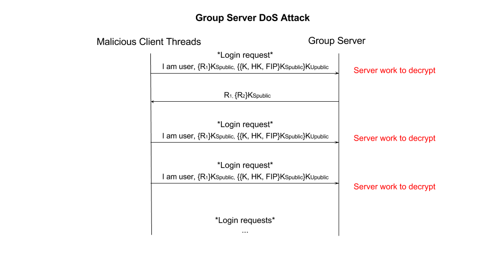
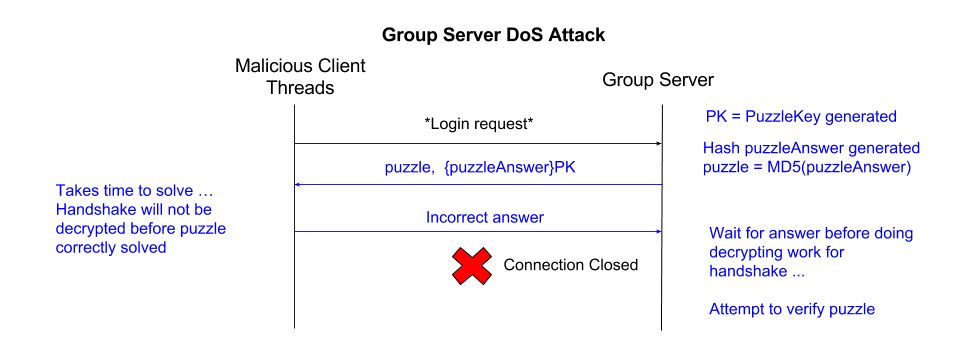
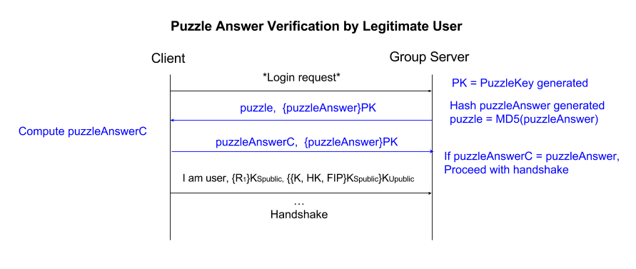

# Phase 5
We have added new mechanisms to deal with an additional threat model while keeping our main ideas of ease of use and coverage at the forefront.

* **AES:** For symmetric key encryption within our system, we have utilized AES with a 128 bit key size. For a secret server key to encrypt puzzle answers, we also chose to use AES 128 bit keys. We chose 128 bit keys over 256 bit keys as 128 bit keys are significantly faster but still sufficient security-wise, and 128-bit is the largest allowed by JavaCrypto. We utilize CBC as the mode of operation as CBC provides message dependence for generating cipher text unlike ECB mode, which is subject to code book attacks.
* **MD5:** We previously utilize MD5 within our system for generating public key fingerprints. We use MD5 as the method for our hash inversion puzzle because it will force clients to brute force a hash inversion solution. We feel that MD5 is robust enough to provide data integrity for the work required of it, as well as provide economy of mechanism with the rest of our codebase.

## Threat Model
**T8 Group Server Denial of Service** Clients are not limited or restricted on the number of login requests that can be sent to the group server.

## Attacks
### Description
Users of the file sharing system are considered untrustworthy. In the current implementation there is no limiter on requests to log in to the group server, meaning that the initial handshake can repeated indefinitely. Without intervention, a malicious user can spin up an unlimited number of threads to send login requests to the group server. A malicious user who knows a user's login name can repeatedly send handshakes which pose a computational cost to the server. In the initial handshake the server must decrypt a nonce with the group server's private key, decrypt the set containing the encrypted session key, the HMAC key and file server IP with the user's private key, and finally decrypt that set with the server's private key. The diagram for this handshake is included below. A flood of such requests has the potential to cause denial-of-service to legitimate users who wish to interact with the file system. As demonstrated with our attack program, a legitimate user sending an infinite stream of initial handshakes blocks other users from correctly connecting to the group server. This disrupts use of the group server from legitimate users, which denies users access to the file sharing system at large due to the fact that tokens can only be retrieved from the group server. 

### Evidence and Justification of Attack
This attack is possible due to 1) lack of restrictions on the number of threads and/or login attempts, and 2) the fact that the login procedure is not computationally free due to the handshake. It is easy for the attack program to generate random data, but it takes time and cycles for the server to decrypt this random data. This attack compromises data availability, as authorized users trying to access group files or other group data will be unable to. A successful attack of this type, demonstarted by the attack program, disables the entire file sharing system, as users must retrieve their user token from the group server to interact with any file server.

## Counter Measure
We will utilize computational puzzles to protect against the group server denial of service attack.

### Description
Computational puzzles make the client pay for their request by first solving a hard puzzle. Making the client solve such a puzzle, which takes time, limits the rate at which random requests can be sent and thus reduces the use of server resources.

**Hash Inversion Puzzle:**
Specifically, we implemented a hash inversion puzzle. When users attempt to log in (by sending a login request), the group server will reply with a hash inversion puzzle before any work by the server will be done. The group server will first generate a **secret 128-bit AES key using CBC mode**, and a **random puzzle answer of length 8 bits**. The group server will then compute the MD5 hash of the random puzzle answer to serve as the puzzle. The server will encrypt the random puzzle answer with the secret key. The server will then transmit a message consisting of the puzzle, and the encrypted puzzle answer to the client. The user must then invert the hash function by brute force and return the correct solution to the server, along with the encrypted answer sent by the server. The server will decrypt the correct answer and verify the client's answer before using any resources to decrypt the handshake. If the client provides an incorrect answer to the hash inversion, the connection will be closed.

### Justification
A hash inversion puzzle will limit the rate at which automated requests can be sent. This countermeasure can be used to mitigate this DoS attack becuase clients are assumed to have approximately similar computational ability, and the puzzles are efficiently generated on the server end. We decided to use a hash inversion puzzle in particular as it is more mathematically difficult to solve than a simple question-and-response puzzle, and since random puzzles will not be reused there is no possibility of forming a puzzle lookup table. By sending the encypted puzzle answer that may only be decypted by the server's public key, the puzzle state is offloaded to the user. The group server does not need to maintain vulnerable state that can be attacked while the user works on solving the puzzle. 

### Conclusion
The principles of our file sharing system have been ease of use and coverage since the first phase of implementation. The countermeasures described for this threat provide coverage against denial-of-service attacks. The counter measures are also minimally disruptive to legitimate users, which extends our theme of ease of use. 
