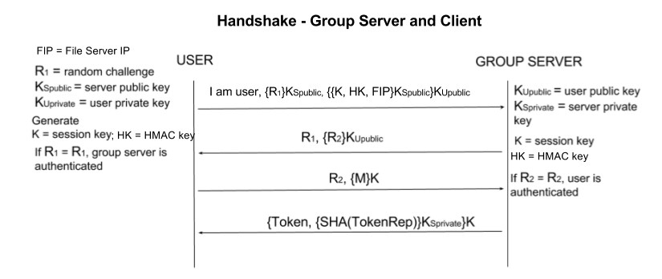
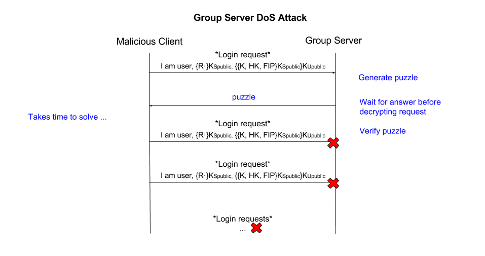
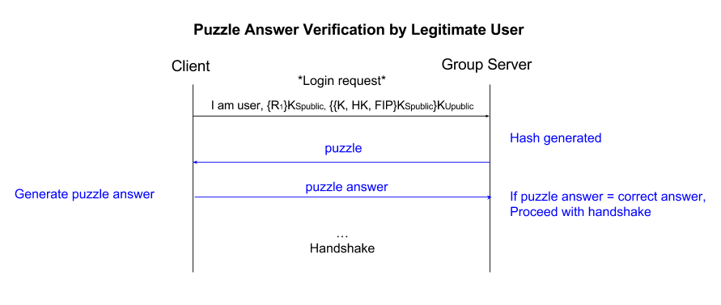

# Phase 5
We have added new mechanisms to deal with an additional threat model while keeping our main ideas of ease of use and coverage at the forefront.

## Threat Model
**T8 Group Server Denial of Service** Clients are not limited or restricted on the number of login requests that can be sent to the group server.

## Attacks
### Description
Users of the file sharing system are considered untrustworthy. In the current implementation, there is no limit to the number of times in which a user can request to log in to the group server, meaning that the initial handshake can repeated indefinitely. Without intervention, a malicious user can send an unlimited number of login requests to the group server. An malicious user who has a valid account can repeatedly send handshakes which pose a computational cost to the server. In the initial handshake the server must decrypt a nonce with the group server's private key, decrypt the set containing the encyrpted session key, the HMAC key and file server IP with the user's private key, and finally decrypt that set with the server's private key. The diagram for this handshake is included below. A flood of such requests has the potential to cause denial-of-service to legitimate users who wish to interact with the file system. As demonstrated with our attack program, a legitimate user sending an infinite stream of initial handshakes blocks other users from correctly connecting to the group server. This disrupts use of the group server from legitimate users, which denies users access to the file sharing system at large due to the fact that tokens can only be retrieved from the group server. 

### Evidence and Justification of Attack
This attack is possible due to 1) lack of restrictions on login requests, and 2) the fact that the login procedure is not computationally free due to the handshake. It is easy for the attack program to generate random data, but it takes time and cycles for the server to decrypt this random data. This attack compromises data availability, as authorized users trying to access group files or other group data will be unable to. A successful attack of this type, demonstarted by the attack program, disables the entire file sharing system, as users must retrieve their user token from the group server to interact with any file server.

## Counter Measure
We will utilize computational puzzles to protect against the group server denial of service attack.

### Description
Computational puzzles make the client pay for their request by first solving a hard puzzle. Making the client solve such a puzzle, which takes time, limits the rate at which random requests can be sent and thus reduces the use of server resources.

**Hash Inversion Puzzle:**
Specifically, we implemented a hash inversion puzzle. When users attempt to log in, the group server will first generate a cryptographic hash function for a puzzle of length 16. The server will transmit a message consisting of the puzzle state, length, and hash function to the user. The user must then invert the hash function and return the correct solution to the server before the server will use resources to decrypt the handshake. 

### Justification
A hash inversion puzzle will limit the rate at which automated requests can be sent. This countermeasure can be used to mitigate this DoS attack becuase clients are assumed to have approximately similar computational ability, and the puzzles are efficiently generated on the server end. We decided to use a hash inversion puzzle in particular as it is more mathematically difficult to solve than a simple question-and-response puzzle, and the server isn't required to save any state beyond the 16 bit puzzle answer. Puzzle state is offloaded to the user so that the server does not need to maintain vulnerable state in which it can be attacked while the user works on solving the puzzle. 

### Conclusion
The principles of our file sharing system have been ease of use and coverage since the first phase of implementation. The countermeasures described for this threat provide coverage against data avaliability attacks. The counter measures are also minimally disruptive to legitimate users, which extends our theme of ease of use. 
