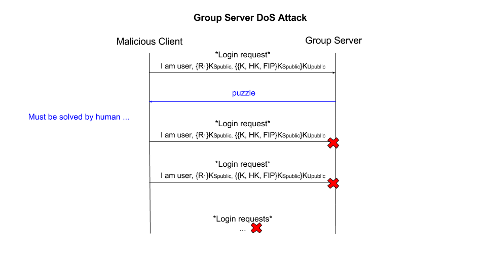
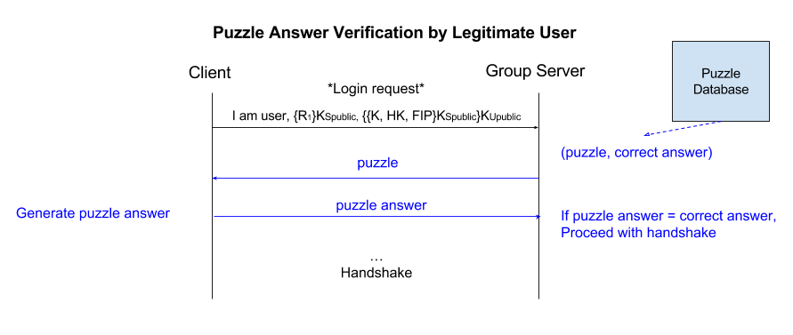

# Phase 5

## Threat Model
**T8 Group Server Denial of Service** Users are not limited or restricted on the number of login requests that can be sent to the group server.

## Attacks
### Description
Users of the file sharing system are considered untrustworthy. In the current implementation, there is no limit to the number of times in which a user can be logged in to the group server or request to be logged in. Without intervention, a malicious user can send an unlimited number of login requests to the group server. An adversary has the ability to continuously send requests to the group server causing it to slow or even crash and shut down. A flood of such requests has the potential to cause denial-of-service to legitimate users who wish to interact with the file system.

To carry out this attack, an adversary will send a continuous stream of login requests to the group server. With enough requests, service to legitimate users will be disrupted.

### Evidence and Justification of Attack
This attack is possible due to 1) lack of restrictions on login requests, and 2) the fact that users may be logged in to the same account on the group server via any number of different clients. This attack compromises data availability, as authorized users trying to access group files or other grouo data will be unable to. If an attack of this type is successful, then the entire file sharing system is disabled, as users must retrieve their user token from the group server to interact with any file server.

## Counter Measure
We will utilize restrictions on the number of active user accounts at one time and computational puzzles to protect against the group server denial of service attack.

### Description
There is the possibility of two types of login requests that an adversary can flood the group server with: login requests for a legitimate user with the correct private key, and garbage login requests and garbage private keys.

**Restriction on Active User Accounts:**
A restriction on the number of different clients that may be logged in to the same user account will be restricted to one. When a user successfully logs in to the group server, no other client may also log in to that user account. Once a user is logged in, subsequent requests to login to that account will be blocked. This protects against the flood of legitimate user login requests.

**Challenge-Response Puzzle:**
When users attempt to log in, they will first be presented with a challenge-response puzzle sent from the group server. The puzzle will be easy for the group server to generate, as it will pull puzzle/answer pairs from a database of puzzles. The puzzle will be relatively easy for a human to solve quickly and since legitimate users will be logging in infrequently, this will be minimally disruptive. The puzzle will be difficult for a computer to solve. Until the puzzle is correctly solved, further requests to the group server by that IP will be disregarded.

The challenge-response puzzle format will be human verifiable, but difficult for a computer to solve. For example:

puzzle: "two times ten equals"; answer:"20"

puzzle: "what state is pittsburgh located in"; answer: "pennsylvania"

To prevent a DoS attack flood of bad responses to the puzzle, after three failed attempts the requests from that IP address will be blocked by the Group Server for 5 minutes.

### Justification
Allowing only one client to be logged into a user account at one time places restrictions on using valid login user name and private keys to flood the server with requests. A challenge-response puzzle will limit the rate at which automated requests can be sent. This countermeasure can be used to mitigate this DoS attack becuase clients are assumed to have approximately similar computational ability, and the puzzles are efficiently generated on the server end. 

### Previous Handshake Diagram

### Conclusion
The principles of our file sharing system have been ease of use and coverage since the first phase of implementation. The countermeasures described for this threat provide coverage against data avaliability attacks. The counter measures are also minimally disruptive to legitimate users, which extends our theme of ease of use. 
